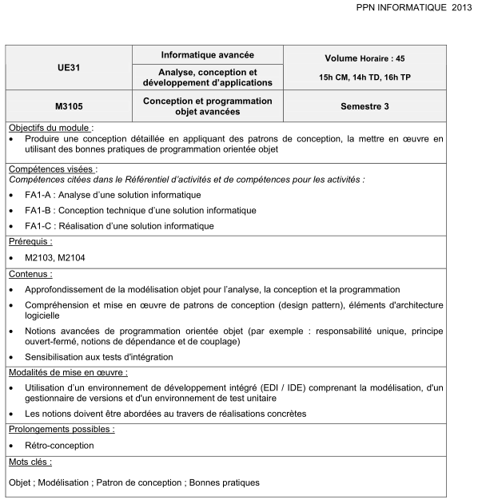

# Conception et Programmation Objet Avancées
---
Conception et Programmation objet avancées (module M3105) : bonnes pratiques, doublures de test, principes SOLID, Design Patterns. 
 
*Ce module fait suite au [module M2104 : Bases de la Conception Orientée Objet (conception classique & émergente, bonnes pratiques, TDD).](https://github.com/iblasquez/enseignement-iut-m2104-conception)* 

## Supports de cours

- [Doublures de test](slides/TestDouble_Mockito.pdf) 
- [Ecrire du code SOLID](slides/SOLID.pdf) 

 
### Patterns 
- [ Présentations de quelques design patterns et autres notions avancées de conception logicielle (travaux réalisés par les étudiants depuis 2017)](patterns/design_presentations.md)
- [Quelques références autour des Design Patterns](patterns/references_patterns.md)

## Enoncés de TD

- TD n° 1 (inspiration **[Kata Tennis](https://github.com/emilybache/Tennis-Refactoring-Kata)**) :  
[Mise en place de bonnes pratiques de développement autour du refactoring du Kata Tennis](TD/M3105_BonnesPratiques_KataTennis.pdf) 

- TD n° 2 (inspiration  **[Kata Racing Car](https://github.com/emilybache/Racing-Car-Katas)**) :  
--> [Ecrire du code SOLID ](TD/M3105_tirePressureMonitoringSystem_SOLID.pdf)  
--> [Améliorer la lisibilité des tests (Builder, Factory) ](TD/M3105_tirePressureMonitoringSystem_LisibiliteTest.pdf)  

- TD n° 3 (inspiration  **[Kata Parrot](https://github.com/emilybache/Parrot-Refactoring-Kata)**) :  
[Kata Parrot (guidé) ](TD/M3105_SOLID_Polymorphism_KataParrot.pdf) 

- TD n° 4 (inspiration  **[Kata Kebab](https://github.com/malk/the-kebab-kata)** & pattern Visiteur) :  
[Kata Kebab à notre sauce : visitons les kébabs !](TD/M3105_Kebab.pdf)    
<!-- 
 Anciennement, les énoncés utilisés étaient :  
[Kata Kebab à notre sauce : une première implémentation du problème](TD/M3105_Kebab_Presentation.pdf)   
[Kata Kebab à notre sauce : décorons les kebabs !](TD/M3105_Kebab_Decorateur.pdf)  
[Kata Kebab à notre sauce : visitons les kébabs !](TD/M3105_Kebab_Visiteur.pdf) 
-->

- TD n° 5 (pattern Chaine de responsabilité : CoR) :   
--> [A la découverte du pattern Chaîne de Responsabilité](TD/M3105_Pattern_ChaineDeResponsabilite.pdf)  
--> [Retour vers le Fizz Buzz ! Un Fizz Buzz SOLIDe qui (en)chaîne des responsabilités](TD/M3105_FizzBuzz_CoR.pdf) 

- TD n° 6 (inspiration  **[What to Look for in a Code Review](https://leanpub.com/whattolookforinacodereview)**) :  
--> [Une SOLIDe revue de code](TD/M3105_SOLID_Revue.pdf)  
--> [Une autre SOLIDe revue de code](TD/M3105_SOLID_Revue_Autre.pdf)   
--> A lire également : [Code Smells: Too Many Problems](https://blog.jetbrains.com/idea/2017/09/code-smells-too-many-problems/)  

*Tous vos TD doivent être versionnés !*

## Enoncés de TP

- TP n°1 :  
[Prise en main des doublures de test et de Mockito](https://github.com/iblasquez/tuto_mockito)

- TP n°2 (inspiration  **[Kata Gilded Rose](https://github.com/emilybache/GildedRose-Refactoring-Kata)**) :  
[Kata Gilded Rose](TD/M3105_GildedRose.pdf) 

- TP n°3 : [Kata Mars Rover](TD/M3105_MarsRover.pdf)  

- Autre TP (inspiration  **[Kata Trivia](https://github.com/jbrains/trivia)**) :  
[Qualité & harnais de tests sur le kata Trivia : SonarQube, Golden Master, Approval Testing](TD/M3105_Trivia.pdf) 

*Tous vos TP doivent être versionnés !*

## Autres

#### Références autour des doublures de test

- [Mock Roles, not Objects](http://www.jmock.org/oopsla2004.pdf) de Steve Freeman, Nat Pryce, Tim Mackinnon, Joe Walnes (OOPSLA 2004)
- [Mocks Aren't Stubs](https://martinfowler.com/articles/mocksArentStubs.html) sur le blog de Martin Fowler
-  [xUnit Test Patterns](https://www.amazon.com/xUnit-Test-Patterns-Refactoring-Code/dp/0131495054) de Gerard Meszaros(rubrique TestDouble en ligne [ici](http://xunitpatterns.com/Test%20Double.html)) 
-  [Growing Object-Oriented Software Guided by Tests](http://www.growing-object-oriented-software.com) de Steve Freeman and Nat Pryce 

... mais aussi [***Doublures en Folie***](http://agilitateur.azeau.com/public/doublures-en-folie/doublures-en-folie.v1.html), la saynète imaginée par [Olivier Azeau](https://twitter.com/oaz) (teasing [ici](https://www.youtube.com/watch?v=5gkmE0lfkrs))

## Extrait du [PPN Informatique DUT Informatique](https://cache.media.enseignementsup-recherche.gouv.fr/file/25/09/7/PPN_INFORMATIQUE_256097.pdf)

## On en discute ?
Pour les discussions, c'est par [là](https://github.com/iblasquez/enseignement-iut-m3105-conception-avancee/issues)  
Pour les propositions de contenu, de modification par [ici](https://github.com/iblasquez/enseignement-iut-m3105-conception-avancee/pulls)  
Et bien sûr, n'hésitez pas à personnaliser vos messages avec des [emojis](http://www.webpagefx.com/tools/emoji-cheat-sheet/) :smile:

Licence
-------

Tous ces supports sont placés sous licence CC BY-NC-SA :  [Creative Commons
Attribution - Pas d'Utilisation Commerciale - Partage dans les Mêmes Conditions](https://creativecommons.org/licenses/by-nc-sa/4.0/)

En savoir plus sur [les licences Creative Commons](https://creativecommons.org/licenses/?lang=fr-FR) ...

Toutefois, toute personne enseignant au département Informatique de l'IUT du Limousin souhaitant utiliser ces documents doit demander une autorisation préalable :smile:

